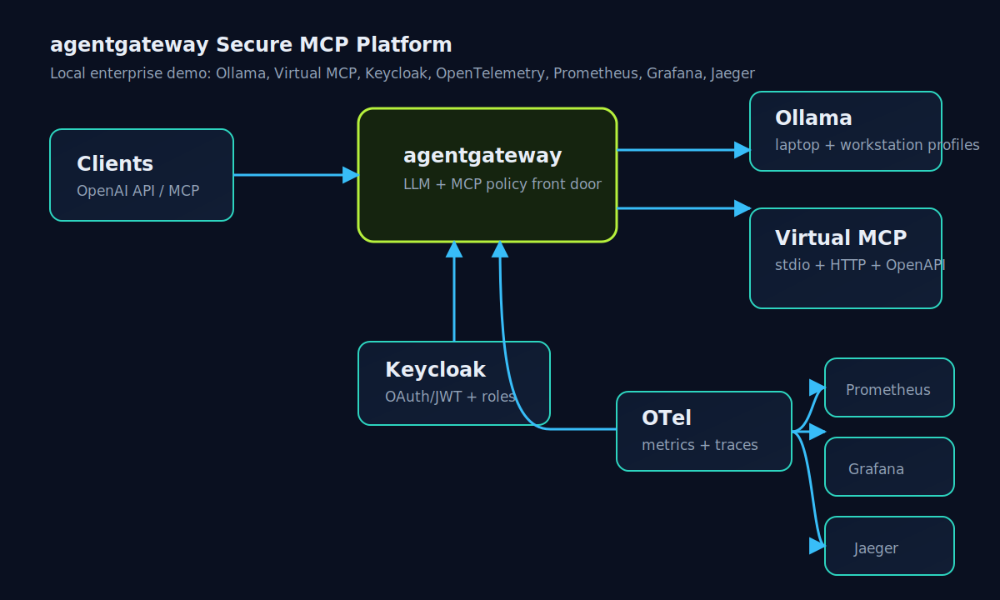
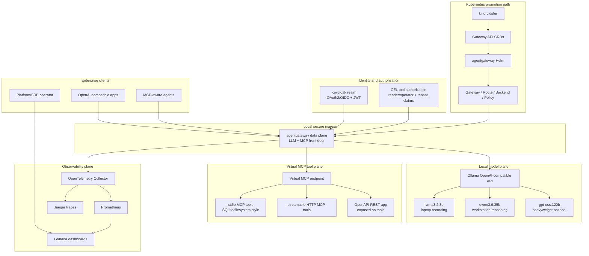

# agentgateway-secure-mcp-platform

Enterprise-grade, fully local reference setup for [agentgateway](https://agentgateway.dev/) focused on secure MCP access with RBAC, OAuth/JWT, multi-tenancy, and full observability.

This repository is a runnable demo architecture, not a fork of agentgateway. The upstream [agentgateway/agentgateway](https://github.com/agentgateway/agentgateway) project is used as reference-only source material for patterns and terminology. This repo keeps its own enterprise demo layout for local Docker, Kubernetes, identity, observability, sample MCP services, and smoke tests.

**Repository:** [GuruduGanesh/agentgateway-secure-mcp-platform](https://github.com/GuruduGanesh/agentgateway-secure-mcp-platform.git)

## Architecture





## Enterprise Folder Structure

```text
agentgateway-secure-mcp-platform/
  README.md                           # this file — reference-architecture overview
  LICENSE                             # Apache-2.0 (matches upstream)
  demo.ps1  demo.cmd                  # one-click local demo launcher
  .env.example                        # public-safe local defaults
  .gitignore
  assets/
    diagrams/                         # public architecture visuals
  config/
    agentgateway/standalone/          # standalone data-plane configs
    identity/keycloak/                # importable demo realm
    observability/                    # otel/prometheus/grafana config
  deploy/
    docker/                           # compose entrypoint for local profiles
    kubernetes/
      kind/                           # local cluster definition
      gateway-api/                    # CRD install notes
      helm/                           # agentgateway Helm values
      manifests/                      # Gateway API + agentgateway CRs
  docs/
    STATUS.md                         # single source of truth (done vs pending)
    SETUP.md                          # end-to-end from-scratch runbook
    architecture/  demo/  operations/  security/  blog/
  examples/
    mcp-servers/                      # stdio, HTTP, and OpenAPI tool sources
  tests/
    smoke/                            # runnable per-milestone validation scripts
```

Why this shape:

- `config/` stores declarative platform configuration by concern.
- `deploy/` stores deployment mechanisms by runtime target.
- `examples/` stores demo workloads that sit behind the gateway.
- `tests/` stores repeatable validation, separate from operational scripts.
- `docs/` stores durable design and runbook material.
- `assets/` stores public visuals used by README/docs.

## Version Matrix

| Component | Pinned version |
| --- | --- |
| agentgateway image | `cr.agentgateway.dev/agentgateway:v1.3.1` |
| agentgateway Helm chart | `oci://cr.agentgateway.dev/charts/agentgateway --version v1.3.1` |
| agentgateway CRDs chart | `oci://cr.agentgateway.dev/charts/agentgateway-crds --version v1.3.1` |
| Gateway API CRDs | `v1.5.0` |
| kind | `v0.32.0` |
| Kubernetes target | `v1.36.x` |
| Helm | `v3.21.2` |
| Keycloak | `quay.io/keycloak/keycloak:26.6.3` |
| OpenTelemetry Collector | `otel/opentelemetry-collector-contrib:0.154.0` |
| Prometheus | `prom/prometheus:v3.12.0` |
| Grafana | `grafana/grafana:13.0.2` |
| Jaeger | `jaegertracing/jaeger:2.8.0` |
| Ollama laptop recording model | `llama3.2:3b` |
| Ollama laptop secondary model | `qwen2.5:7b` |
| Ollama default model (laptop) | `llama3.2:3b` |
| Ollama optional 2nd alias (laptop) | `qwen2.5:7b` |
| Ollama optional high-reasoning (workstation) | `qwen3.6:35b` |
| Ollama optional heavyweight (workstation) | `gpt-oss:120b` |
| Ollama optional max-reasoning reference (workstation) | `deepseek-r1:671b-0528-q4_K_M` |

## Prerequisites

- Windows with Docker Desktop.
- PowerShell 7 or Windows PowerShell.
- [Ollama](https://ollama.com/) running on the host.
- Optional for Kubernetes milestone: `kind`, `kubectl`, and Helm.
- Optional for local sample MCP servers: Node.js 20+.

RAM guide: the recording path uses `llama3.2:3b` by default so the demo stays reproducible on a normal laptop. The high-reasoning profile uses `qwen3.6:35b` and documents `gpt-oss:120b` / `deepseek-r1:671b-0528-q4_K_M` as workstation-class references.

## One-Click Demo

The fastest path: run the launcher. It checks Docker and Ollama, brings up every
profile, handles the Keycloak/JWKS boot race, and prints the demo steps, URLs, and
credentials.

```powershell
pwsh ./demo.ps1                  # bring up the Docker demo + print the guide
pwsh ./demo.ps1 -Verify         # also run the smoke tests to prove each milestone
pwsh ./demo.ps1 -WithKubernetes # also set up the kind/Helm M6 promotion
pwsh ./demo.ps1 -Down           # tear everything down (Docker + kind)
```

On Windows you can also just double-click `demo.cmd`. The full on-camera talk track
is in [docs/demo/DEMO.md](docs/demo/DEMO.md). The manual step-by-step is below.

## Quickstart: Standalone LLM Gateway

1. Copy the environment template:

```powershell
Copy-Item .env.example .env
```

2. Pull local models:

```powershell
ollama pull llama3.2:3b            # required — the default laptop path
ollama pull qwen2.5:7b             # optional — only for the model-aliasing demo
```

3. Start observability and the laptop-safe standalone gateway:

```powershell
docker compose -f deploy/docker/docker-compose.yml --profile observability --profile laptop up -d
```

4. Send one OpenAI-compatible request through agentgateway:

```powershell
.\tests\smoke\smoke-llm.ps1
```

Expected result: an HTTP 200 chat completion from `http://localhost:3000/v1/chat/completions` using local Ollama behind agentgateway.

For a high-reasoning workstation profile:

```powershell
ollama pull qwen3.6:35b
docker compose -f deploy/docker/docker-compose.yml --profile observability --profile llm up -d
.\tests\smoke\smoke-llm.ps1 -Model enterprise-reasoning-latest
```

## Repeatable Setup

Every step is plain `docker compose` plus the smoke tests under `tests/smoke/`, so the
demo reproduces identically on any machine. The authoritative, fully explained
from-scratch runbook is [docs/SETUP.md](docs/SETUP.md).

## Current Status

All six milestones are verified end-to-end locally (last full re-run 2026-06-28; agentgateway `v1.3.1`, Ollama `llama3.2:3b`).

| Milestone | State | Evidence |
| --- | --- | --- |
| M1 Standalone Docker + Ollama | **Verified** | `smoke-llm.ps1`: no-auth → 401, valid Bearer → 200 + real completion; metrics on `:15020` |
| M2 LLM resilience / failover | **Verified** | `smoke-m2.ps1` 3/3: dead primary trips breaker, traffic fails over to live backup via `health.eviction` |
| M3 MCP federation | **Verified** | 6 tools federated + prefixed (`sqlite_`/`http_`/`openapi_`); `initialize`/`tools/list`/`tools/call` through the gateway |
| M4 Security/RBAC | **Verified** | `smoke-rbac.ps1` 7/7: no-token → 401; reader limited to read tools (filtered + denied); operator writes allowed; OpenAPI query-param round-trips |
| M5 Observability | **Verified** | Prometheus target UP on `:15020` (`agentgateway_requests_total` increments), Grafana dashboard provisioned, Jaeger receives gateway traces |
| M6 Kubernetes/Helm | **Verified** | kind + Helm v1.3.1 CRDs; Gateway Programmed, Backend Accepted, Policy Accepted+Attached; `smoke-k8s.ps1 -E2E` drives a live LLM call through the in-cluster gateway |

**Tracking & setup (living docs):** done-vs-pending checklist → [docs/STATUS.md](docs/STATUS.md); from-scratch local setup → [docs/SETUP.md](docs/SETUP.md).

## Demo Milestones

1. Standalone Docker + Ollama: runnable and recordable with the laptop profile (verified).
2. LLM resilience: `resilient` virtual model with `failover` routing + `health.eviction` outlier detection; proven dead-primary → live-backup with `smoke-m2.ps1` (load-balancing/content-routing variants remain optional).
3. MCP federation: stdio (served over HTTP), streamable HTTP, and OpenAPI targets federated behind one Virtual MCP endpoint; verified end-to-end through the gateway.
4. Security: Keycloak realm + listener-level MCP RBAC (CEL); reader/operator allow-deny + multi-tenant claims proven with `smoke-rbac.ps1` (7/7).
5. Observability: OTel → Prometheus/Grafana/Jaeger; gateway metrics scraped and traces received (verified).
6. Kubernetes: kind/Helm promotion with the live agentgateway CRDs; a real LLM call flows through the in-cluster gateway (verified). Promoting M4 JWT/RBAC into `spec.traffic` CRDs remains the one open stretch item.

Full runbook: [docs/demo/DEMO.md](docs/demo/DEMO.md).

## Security Model

- Demo identity provider: local Keycloak realm in `config/identity/keycloak/realm-agentgateway.json`.
- Demo users:
  - `alice-reader` / `reader-password`: tenant `tenant-a`, role `reader`.
  - `oliver-operator` / `operator-password`: tenant `tenant-b`, role `operator`.
- Tool access intent:
  - `reader` can call read-only tools.
  - `operator` can call read and write tools for the same tenant.
  - Cross-tenant requests are denied.
- `.env`, real secrets, generated databases, logs, traces, and local artifacts are ignored.

## Observability

The local observability profile provides:

- OpenTelemetry Collector on OTLP ports `4317` and `4318`.
- Prometheus on `http://localhost:9090`.
- Grafana on `http://localhost:3001` with admin credentials from `.env`.
- Jaeger UI on `http://localhost:16686`.

Start it with:

```powershell
docker compose -f deploy/docker/docker-compose.yml --profile observability up -d
```

## Kubernetes Promotion

The Kubernetes milestone uses kind. Install order matters:

```powershell
kubectl apply -f https://github.com/kubernetes-sigs/gateway-api/releases/download/v1.5.0/standard-install.yaml
helm install agentgateway-crds oci://cr.agentgateway.dev/charts/agentgateway-crds --version v1.3.1 -n agentgateway-system --create-namespace
helm install agentgateway oci://cr.agentgateway.dev/charts/agentgateway --version v1.3.1 -n agentgateway-system -f deploy/kubernetes/helm/values.yaml
kubectl apply -f deploy/kubernetes/manifests/
```

The default Kubernetes path keeps Ollama on the host and reaches it from pods through `host.docker.internal`.

## Documentation

Key entry points:

| Doc | Purpose |
| --- | --- |
| [docs/SETUP.md](docs/SETUP.md) | Authoritative from-scratch setup runbook (software, ports, credentials, troubleshooting) |
| [docs/STATUS.md](docs/STATUS.md) | Single source of truth — milestone states, work log, open checklist |
| [docs/demo/DEMO.md](docs/demo/DEMO.md) | On-camera recording flow |
| [docs/operations/README.md](docs/operations/README.md) | Profiles, common commands, troubleshooting |
| [docs/security/README.md](docs/security/README.md) | Identity / RBAC model |

## License

This repository is licensed under the [Apache License 2.0](LICENSE), matching the upstream [agentgateway](https://github.com/agentgateway/agentgateway) project. agentgateway itself is a separate work owned by its authors and the Linux Foundation; this repo only references it and ships pinned upstream images/charts — it is not a fork.

## Production Caveats

This is a local demo reference, not a production deployment. Before production use, replace demo credentials, configure TLS/mTLS, externalize secret management, use HA control/data planes, pin chart digests, add policy review, define SLOs, and connect to enterprise identity and audit systems.
